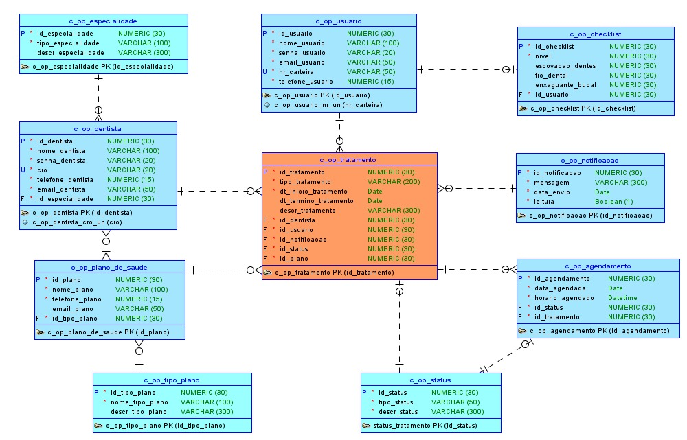

# Odontofast - Aplicação Web com Spring MVC para Dentistas

**Odontofast** Spring MVC, é uma aplicação web MVC desenvolvida como parte da 3ª Sprint do Challenge para a Odontoprev. Este projeto utiliza o framework **Spring Boot** com **Thymeleaf** para criar templates dinâmicos, integrado a um banco de dados **Oracle** para persistência de dados. A aplicação visa facilitar a gestão da rotina de dentistas com seus pacientes, oferecendo funcionalidades como cadastro, login, dashboard e gerenciamento de agendamentos.

## Descrição do Projeto
O **OdontoFast** é uma aplicação web voltada para dentistas, parcialmente finalizada, que oferece suporte à gestão de suas atividades diárias. Até o momento, o projeto inclui:

## Tecnologias Utilizadas

O projeto utiliza as seguintes tecnologias:

### Backend
- **Java 21** - Linguagem de programação utilizada no desenvolvimento.
- **Spring Boot 3.4.3** - Framework para desenvolvimento rápido e simplificado.
- **Spring MVC** - Arquitetura para desenvolvimento de aplicações web seguindo o padrão Model-View-Controller.
- **Spring Boot Starter Web** - Módulo essencial para criação de APIs REST e aplicações web.
- **Spring Boot Starter Data JPA** - Facilita a integração com bancos de dados usando JPA e Hibernate.
- **Spring Boot DevTools** - Ferramenta que melhora a experiência de desenvolvimento, com recarga automática.
- **Spring Boot Starter Thymeleaf** - Template engine para renderização dinâmica de páginas HTML no servidor.

### Banco de Dados
- **Oracle Database** - Banco de dados utilizado para armazenamento de informações.
- **Oracle JDBC Driver (ojdbc11)** - Driver JDBC para conexão da aplicação com o banco de dados Oracle.

### Build e Gerenciamento de Dependências
- **Maven** - Ferramenta utilizada para gerenciamento de dependências, build e empacotamento do projeto.

### Frontend
- **Thymeleaf** - Template engine para geração dinâmica de páginas HTML.
- **HTML, CSS e JavaScript** - Tecnologias utilizadas para a interface do usuário.

## Instrução de Como Rodar a Aplicação  

   1. Clone o repositório:
      ```bash
      git clone https://github.com/sousa-sara/odontofast-spring-mvc.git
      ```
   2. Acesse o diretório do projeto:
      ```bash
      cd odontofast-spring-mvc
      cd odontofast
      ```
   3. Certifique-se de ter o JDK 21 e Maven instalados.
   4. Compile e inicie a aplicação:
      ```bash
      mvn spring-boot:run
      ```
   5. Acesse a aplicação em: `http://localhost:8080/dentista/login` e para autenticar-se:
   -  No campo CRO, digite: **CRO12345**
   -  No campo Senha, digite: **senha123**

## Rotas Implementadas
  - **dentista/login**: Página de autenticação.
  - **dentista/cadastro**: Formulário para registro de novos dentistas.
  - **dentista/home**: Página principal com uma sidebar contendo as opções: *Painel Principal*, *Perfil*, *Agendamentos*, *Relatórios* e *Pacientes*.
  - **dentista/perfil**: Página para atualização de informações sobre dentista.

### Funcionalidades da Home
**Painel Principal**:
   - Um dashboard com informações cruciais:
   - Quantidade de pacientes a serem atendidos hoje.
   - Quantidade de consultas de emergência.
   - Quantidade de consultas pendentes.
   - Agenda do dia, exibindo horário, nome do paciente e tratamento resumido.
**Perfil**:
   - Atualização de dados pessoais (nome, CRO, email e telefone).
   - Opção para alterar a senha.
**Agendamentos**:
   - Filtro para visualizar agendamentos confirmados, pendentes ou cancelados.
   - Prévia dos agendamentos com horário, nome do paciente, tratamento e status.
   - Formulário para criar novos agendamentos com campos: nome do paciente, horário e tratamento.
**Relatórios e Pacientes**:
   - Páginas em desenvolvimento e que serão entregues na Sprint 4, planejadas para integração com dados enviados por pacientes via aplicativo mobile.

### Funcionalidades com Persistência de Dados
- **Cadastro e Login**: permite que dentistas criem contas e façam login.
- **Perfil**: localizada nas opções do sidebar, possui persistência no banco de dados Oracle para que seja feita a atualização dos campos: Nome, CRO, Email e Telefone.

### Testes
- **Cadastro (CREATE)**
Acesse http://localhost:8080/dentista/cadastro

Preencha: Nome: "João Silva", CRO: "CRO121212", Email: "joao@exemplo.com", Telefone: "11987654321", Senha: "123456".

Clique em "Cadastrar" → Redirecionado para /login.

- **Login (READ)**
Acesse http://localhost:8080/dentista/login

Insira CRO: "CRO121212", Senha: "123456" → Redirecionado para /home.

- **Atualizar Perfil (UPDATE)**
Acesse http://localhost:8080/dentista/perfil

Atualize os campos: Nome, CRO, Email e Telefone.

### Objetivo Futuro
A aplicação será integrada a um aplicativo mobile para pacientes, permitindo que eles enviem dados (ex.: solicitações de agendamento) que serão consultados e gerenciados pelo dentista na interface web.

## Requisitos da 3ª Sprint
- **Aplicação MVC**: Desenvolvida com Spring Boot e Thymeleaf.
- **Templates Dinâmicos**: Implementados em todas as páginas (login, cadastro, home, painel, perfil e agendamentos).
- **Integração com Banco de Dados**: Conexão com Oracle para persistência de dados em cadastro, login e atualização de perfil.
- **CRUDs Implementados**:
  1. **CRUD de Dentistas**: Cadastro (CREATE), consulta (READ) e atualização (UPDATE) de perfil.

## Resumo da Estrutura do Projeto OdontoFast

### `controller/`
- **Propósito**: Controladores MVC e REST (ex.: `LoginController`).
- **Motivo**: Gerencia rotas e requisições HTTP.

### `model/`
- **Propósito**: Entidades (ex.: `Dentista`, `Especialidade`).
- **Motivo**: Representa dados e mapeia o banco.

### `repository/`
- **Propósito**: Acesso ao banco (ex.: `DentistaRepository`).
- **Motivo**: Abstrai interação com Oracle (JDBC/JPA).

### `service/`
- **Propósito**: Lógica de negócios (ex.: `DentistaService`).
- **Motivo**: Separa regras de negócio, melhora reusabilidade.

### `static/css/`
- **Propósito**: Arquivos CSS (ex.: `styles.css`).
- **Motivo**: Estilização servida diretamente pelo Spring.

### `templates/`
- **Propósito**: Templates Thymeleaf (ex.: `login-dentista.html`).
- **Motivo**: Gera HTML dinâmico com Thymeleaf.

### `application.properties`
- **Propósito**: Configurações (ex.: conexão Oracle).
- **Motivo**: Centraliza parâmetros da aplicação.

### `pom.xml`
- **Propósito**: Configuração Maven.
- **Motivo**: Gerencia dependências e build.

### Diagrama Banco de Dados
- Modelo Lógico
  


## Link do Vídeo Explicativo e Demonstrativo
[Clique aqui](https://drive.google.com/file/d/1RHPD-TXph08g_gEtoAT0D4lvrMLDHns1/view?usp=sharing)
   
## Integrantes Odontofast
- Felipe Amador - RM553528
- Leonardo Oliveira - RM554024
- Sara Sousa - RM552656
